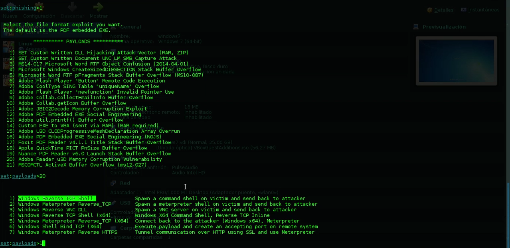
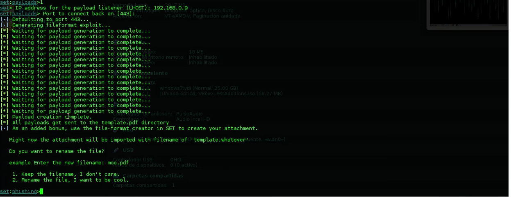
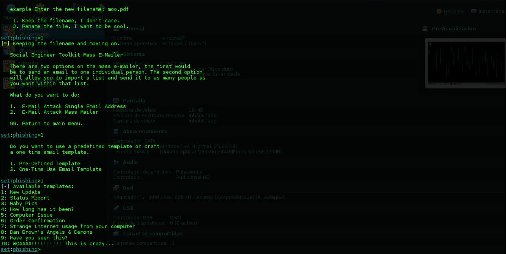
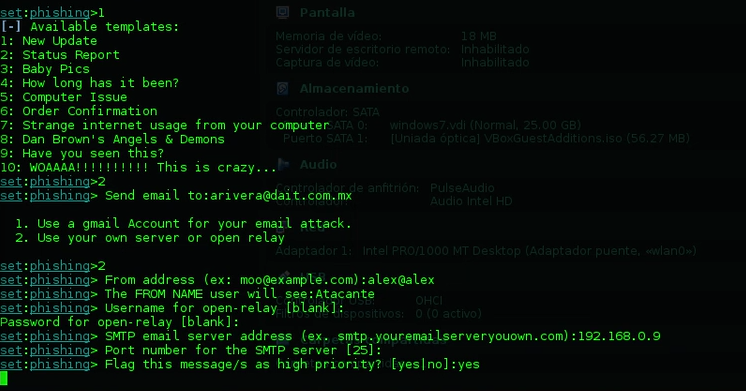

# Spear Phishing

En este apartado se mostrara una tecnica comun de phishing mediante la utilizacion de ingenieria social. Estas tecniucas pueden ser mediante la suplantacion web, envio de correos falsos o suplantaciones de identidades.

herramientas
- Setoolkit
- Kali linux (de preferencia)

nota: Esto funcionara siempre y cuando tengan un servidor de postfix configurado previamente , de tal forma que reconozca el dominio del cual se esta enviando el correo. Guias de configuracion de postfix hay muchas en internet, es bastante sencillo, solo asegurense de tener los puertos correspondientes abiertos.

## Paso 1

Abrimos Settolkit en nuestra terminal de linux, utilizando el comando **setoolkit** . Aqui es donde tendremos nuestra primera vista de una herramienta bastante poderosa en lo que es hacking, en donde veremos algo como esto:

Esta vendria siendo nuestra consola de setoolkit , en donde podemos elegir diversas opciones dependiendo del ataque que o el pentesting que queramos realizar.

Por lo tanto, escogemos la opcion 1 de "**social engineering attacks**" y posteriormente escogemos nuevamente la opcion 1 de "**Spear-phishing attack vectors**". Luego escogemos "**Perform a Mass Email attack**", la cual nos permite mandar una cadena de correos a las personas de una organizacion o simplemente a una de ellas.

## Paso 2

Como bien sabemos de otras entradas, setoolkit nos permite realizar payloads, con lo que se conecta de manera directa con metasploit. Para que nos entendamos:

- **Payload**: Codigo que nos brinda una funcion para aprovecharnos del error de un software (vulnerabilidad).

Habiendo hecho lo anterior, tendremos una lista de opciones, dentro de la cual elegiremos la que dice "**Adobe Reader u3D Memori Corruption Vulenrability**", la cual lo que hara es afectar el equipo en caso de no tener una version muy actualizada de adobe reader (version 20 hacia abajo). Escojemos la opcion y se desplegara otro menu del payload, dentro del cual escogeremos la opcion "**Windows Reverse TCP Shell**"

Esta nos va a mandar una shell por parte de la victima. Luego nos pedira nuestra ip address (aqui os pueden poner la suya privada si es que estan haciendo alguna prueba con maquians virtuales o una publica si lo hacen desde un servidor), nos pedir un puerto (lo dejamos por default que es el 443) y comenzara a ejecutarse el payload.

## Paso 3

Apartir de ahora se ha importado un archivo denominado 'template.whatever' el cual lo podemos renombrar o dejarla asi.
El siguiente menu nos ofrece envieranos el mail de manera personal o de manera masiva. Elegimos la opcion 1 para una persona. Luego nos pregunta si queremos usar un template o crear una para el correo que enviaremos. Elegimos una predefinida y nos ofrecera algunas plantillas disponibles:

Pueden utilizar el que quieran. Luego de elegir una nos preguntara a quien se lo enviaremos y nos brindara dos opciones, si utilizar una cuenta de gmail para realizar el ataque o si usar un "open relay" que vendria siendo un servidor nuestro, escogemos la de open relay y nos pedira la direccion desde donde enviamos asi como otros metadatos del correo:

Ya en este punto se esta enviando el correo electronico y debiese llegar sin problemas al destinatario. Lo demas va a creatividad de ustedes, el hacer una plantilla que sea lo suficientemente convincente para engañar a la victima del ataque y configurar bien su servidor de postfix para no caer en la bandeja de spam.
